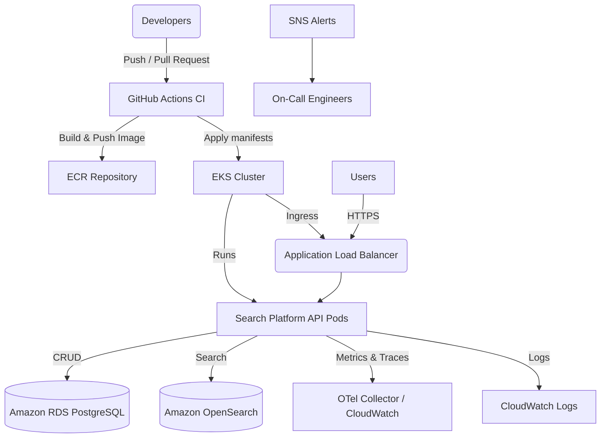

# Deployment Guide

This document describes the production deployment process, supporting infrastructure, and operational playbooks for the Search Platform API.

## Table of Contents

1. [Architecture Overview](#architecture-overview)
2. [Step-by-step Deployment Workflow](#step-by-step-deployment-workflow)
3. [CI/CD Pipeline Responsibilities](#cicd-pipeline-responsibilities)
4. [Rollback Procedures](#rollback-procedures)
5. [Monitoring & Alerting](#monitoring--alerting)
6. [Troubleshooting Checklist](#troubleshooting-checklist)
7. [Disaster Recovery Plan](#disaster-recovery-plan)
8. [Scaling Guidelines](#scaling-guidelines)
9. [Reference Configuration](#reference-configuration)

## Architecture Overview



Key Characteristics:

- **Network isolation**: Workloads run in private subnets, reachable via an Application Load Balancer in public subnets.
- **Managed datastores**: PostgreSQL (RDS) and OpenSearch are provisioned as managed services with encryption at rest and automated backups.
- **Observability first**: Structured logs, Prometheus metrics, and OpenTelemetry traces feed into CloudWatch (and any downstream exporters).
- **Secrets management**: Credentials live in AWS Secrets Manager and are synced into Kubernetes using External Secrets.

## Step-by-step Deployment Workflow

1. **Provision infrastructure** (per environment):
   - Configure Terraform backend (S3 + DynamoDB recommended).
   - Run `terraform apply -var-file=<environment>.tfvars` from `infra/terraform`.
   - Record outputs: EKS cluster name, deploy role ARN, Secrets Manager ARNs.
2. **Install cluster add-ons**:
   - AWS Load Balancer Controller
   - Metrics Server
   - External Secrets Operator
   > **Note:** Update `deploy/kubernetes/overlays/*/kustomization.yaml` image registries to match the ECR URL output by Terraform (`ecr_repository_url`).
3. **Configure GitHub environments** (`Settings ➜ Environments`):
   - `STAGING` and `PRODUCTION` with the following secrets/vars:
     - `AWS_OIDC_ROLE_ARN` (from Terraform output `deploy_role_arn`)
     - `STAGING_EKS_CLUSTER_NAME` / `PRODUCTION_EKS_CLUSTER_NAME`
     - `SLACK_WEBHOOK_URL` (optional notifications)
4. **Prepare secrets** in AWS Secrets Manager:
   - Write JSON objects to `/search-platform/<environment>/database` and `/search-platform/<environment>/opensearch` using Terraform or the AWS console.
   - Ensure a `ClusterSecretStore` named `aws-secrets-manager` exists and is authorised (via IRSA) for the External Secrets operator to access AWS Secrets Manager.
5. **Bootstrap K8s namespaces** (first deploy only):
   - `kubectl apply -k deploy/kubernetes/overlays/staging`
   - Wait for External Secrets to populate `search-platform-api-secrets`.
6. **Trigger deployment**:
   - Staging: merge to `main` or run the `Deploy` workflow manually targeting `staging`.
   - Production: push a `vX.Y.Z` tag or run `workflow_dispatch` with `environment=production`.
7. **Verify rollout**:
   - Check GitHub Actions logs for successful smoke test.
   - Inspect application health: `kubectl get pods -n search-platform-<env>` and `kubectl logs`.
   - Validate external connectivity via `/health` endpoint behind the load balancer.

## CI/CD Pipeline Responsibilities

- **Workflow**: `.github/workflows/deploy.yml`
- **Stages**:
  1. Configure AWS via OIDC and authenticate with ECR/EKS.
  2. Build and push a versioned Docker image (`<environment>-<sha>` + `<environment>-latest`).
  3. Apply the environment-specific Kustomize overlay.
  4. Update the deployment image, run database migrations inside the freshly rolled deployment, and wait for rollout.
  5. Execute an in-cluster smoke test (HTTP call to `/health`).
  6. Notify Slack (optional) and rollback automatically on failure.
- **Quality gates**: The CI workflow (`ci.yml`) runs lint, type-check, tests, npm audit, and Trivy scans on every push/PR before deployment can occur.

## Rollback Procedures

### Automated rollback (pipeline)

If `kubectl rollout status` or the smoke test fails, the workflow runs `kubectl rollout undo` automatically. Slack (if configured) receives a failure message.

### Manual rollback

1. Identify the last known-good image tag (ECR `<environment>-<sha>` or `<environment>-latest`).
2. Manually update the deployment:
   ```bash
   kubectl set image deployment/search-platform-api \
     api=<ecr-repo>/<image>:<tag> \
     -n search-platform-<environment>
   kubectl rollout status deployment/search-platform-api -n search-platform-<environment>
   ```
3. Validate health and remove the problematic image tag from ECR if necessary.

### Database rollbacks

- Schema migrations are executed via `npm run prisma:migrate:deploy`.
- To revert a migration, use `prisma migrate resolve --rolled-back <migration>` and redeploy the last stable release.
- Ensure that destructive rollbacks are coordinated with data owners and that RDS snapshots are available before proceeding.

## Monitoring & Alerting

| Layer | Signals | Destination |
| ----- | ------- | ----------- |
| API | Structured JSON logs, OTEL traces/metrics | CloudWatch Logs, OTEL collector (Prometheus/Grafana) |
| Kubernetes | Pod health, HPA scaling metrics | CloudWatch Container Insights, `kubectl` |
| RDS | CPU, storage, replication lag | CloudWatch Alarms (`rds_free_storage`, `rds_cpu`) |
| OpenSearch | Cluster status, slow queries | CloudWatch Alarms + Log groups |
| CI/CD | Deployment success/failure | GitHub Actions, Slack notifications |

Additional guidance:

- Dashboards: stitch CloudWatch metrics + OTEL traces in a single Grafana board for end-to-end latency insight.
- Alerts: subscribe the on-call rotation to the SNS topic configured by Terraform.
- Log retention: default 30 days; adjust via Terraform if regulatory requirements differ.

## Troubleshooting Checklist

1. `kubectl get events -n search-platform-<env>` for scheduling or probe issues.
2. Inspect pod logs: `kubectl logs deploy/search-platform-api -n search-platform-<env>`.
3. Confirm secrets are mounted: `kubectl describe secret search-platform-api-secrets -n ...`.
4. Validate database connectivity from within the cluster using `kubectl run` with `psql`.
5. Check GitHub Actions artifacts (npm audit report, Trivy scan) for failed quality gates.

See [`docs/TROUBLESHOOTING.md`](./TROUBLESHOOTING.md) for deeper remediation playbooks.

## Disaster Recovery Plan

- **Backups**: RDS automated backups (14-day retention) + manual snapshots before major migrations. OpenSearch automated hourly snapshots retained in S3.
- **Infrastructure as Code**: Terraform state enables full re-creation of the stack in a new region if required. Keep remote state backups in place.
- **Runbooks**:
  - Database restore: promote the latest snapshot to a new RDS instance, update Secrets Manager endpoint, and redeploy.
  - Cluster rebuild: recreate EKS with Terraform, reapply Kubernetes manifests, and restore secrets from Secrets Manager.
- **Testing cadence**: execute DR drills at least quarterly to rehearse RDS snapshot restore and blue/green cutover via separate namespaces.

## Scaling Guidelines

- **Horizontal scaling**: HPA scales pods between 2 and 10 replicas based on CPU (60%) and memory (75%). Tune thresholds via `deploy/kubernetes/base/hpa.yaml`.
- **Vertical scaling**: Adjust container requests/limits in `deployment.yaml` and update node group instance types via Terraform variables (`eks_node_instance_types`).
- **Data tier**: Increase `rds_instance_class`, `rds_allocated_storage`, or `opensearch_instance_type` in Terraform and apply.
- **Traffic management**: Use ALB weights or Route 53 weighted records for staged rollouts.
- **Background tasks**: Leverage the `spot` EKS node group (tainted for `workload=batch`) for asynchronous pipelines.

## Reference Configuration

- **Docker**: `Dockerfile` uses a multi-stage build with production-only dependencies, health checks, and `dumb-init` for PID 1.
- **Compose**: `docker-compose.prod.yml` defines an ops profile for running migrations separately and ships with resource limits + log forwarding.
- **Kubernetes**: Base manifests live in `deploy/kubernetes/base`; environment overlays patch ingress, config, and IAM annotations.
- **Terraform**: All AWS resources and IAM bindings under `infra/terraform` with outputs consumed by CI/CD and Kubernetes.

For day-to-day operational tasks, pair this guide with [`docs/OPERATIONS.md`](./OPERATIONS.md) and update both when architectural changes land.
